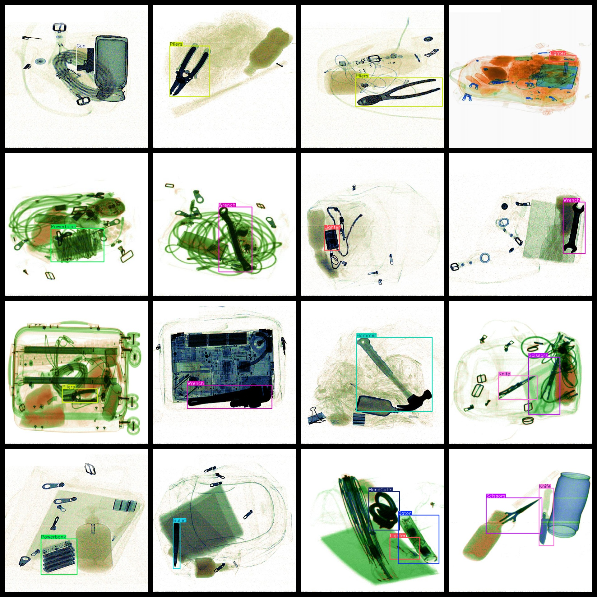
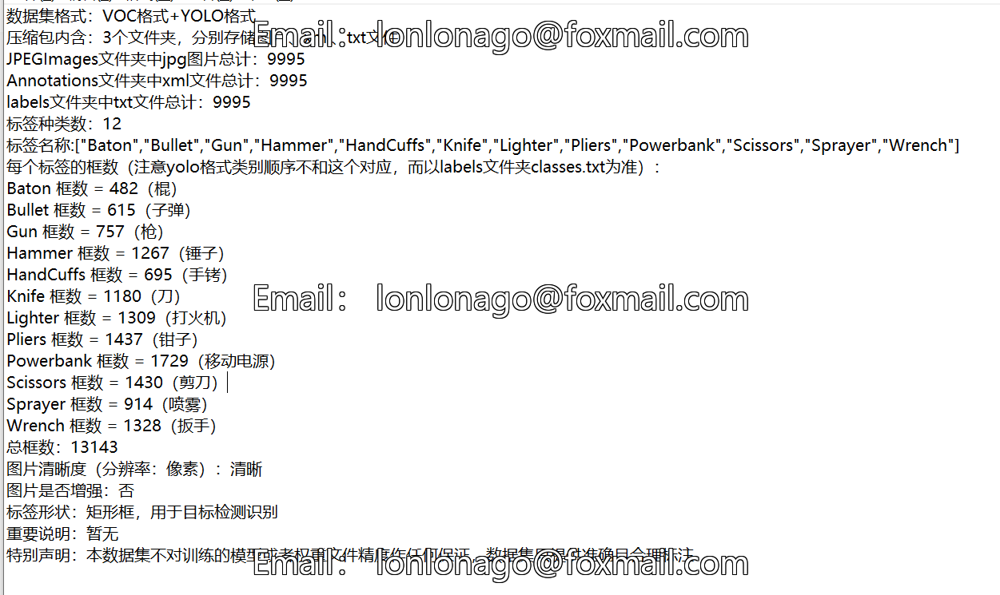

# [Object Detection] XLight Groove-Type Deformation Hazard Re Dataset 9995 images12-classYOLO+VOC format

【Target Detection】X-ray Security Data Set for Hazardous Goods: 9995 images in 12 classes, YOLO+VOC format

Dataset Format: Pascal VOC + YOLO (excluding the split-path txt file; only jpg images with corresponding VOC-format xml files and YOLO-format txt files)

The compressed file contains: three folders, each storing images, xml files, and text files.

The total number of jpg images in the JPEGImages folder is: 9995.

The total number of xml files in the Annotations folder is 9995.

The total number of txt files in the labels folder is 9995.

Number of tag types: 12

Tags: ["Baton", "Bullet", "Gun", "Hammer", "HandCuffs", "Knife", "Lighter", "Pliers", "Powerbank", "Scissors", "Sprayer", "Wrench"]

The number of boxes for each label (Note that the order of labels in the Yolo format does not correspond to this, but is based on the classes.txt file in the labels folder):

Baton frame count = 482 (bars)

Bullets = 615

【757】

Hammer Frame Count = 1267 (hammer)

HandCuffs frame count = 695 (handcuffs)

Knife Frames = 1180（Blades）

Lighter frame count = 1309 (lighter)

Pliers Frame Count = 1437

【】『』「」<>[]

【】『』「」<>[]

Sprayer Frames = 914

Wrench Frames = 1328

Total Frames: 13143

Picture clarity (Resolution: Pixels): Clear

Is the image enhanced: No

Shape of the label: Rectangular box, used for object detection and recognition.

Dataset Type ：199m

Special Notice: This dataset does not guarantee the accuracy or precision of the trained models or weight files. The dataset only provides accurate and reasonable annotations.
## Images

---

Here is a pay link on Stripe (https://buy.stripe.com/3cs8yP7sY87d0vu9AB). Please contact me lonlonago@foxmail.com after funding $89, and I will send you a complete data files, thank you!

